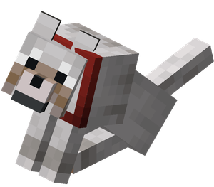
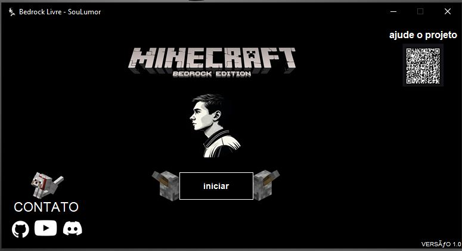

<table>
<tr>
<td align="center" width="100">
  
</td>
<td align="center">

# Bedrock Livre

### Desbloqueador para Minecraft Bedrock Edition

</td>
<td align="center" width="100">
  
</td>
</tr>
</table>

**Desenvolvido por [SouLumor](https://github.com/soulumor)**

---

## 📸 Screenshot

  
  
<em>Interface principal do Bedrock Livre - Desbloqueador para Minecraft Bedrock Edition</em>

---

## ⚠️ IMPORTANTE - EXECUTE COMO ADMINISTRADOR

**TANTO O `BedrockLivre.exe` QUANTO O `INSTALAR_AGORA.bat` DEVEM SER EXECUTADOS COMO ADMINISTRADOR!**

- Clique com **botão direito** no arquivo
- Selecione **"Executar como administrador"**
- Sem permissões de administrador, o programa não funcionará!

## 🚀 Como Usar

### Opção 1: Usando o GUI (Recomendado)

1. **Abra o Minecraft Bedrock Edition** primeiro
2. **Execute `BedrockLivre.exe` como Administrador**
   - Clique com botão direito > "Executar como administrador"
3. Clique no botão **"iniciar"**
4. renicie o minecraft.
4. Pronto! O Minecraft está desbloqueado!

### Opção 2: Usando o Script Manual

1. **Abra o Minecraft Bedrock Edition** primeiro
2. **Execute `INSTALAR_AGORA.bat` como Administrador**
   - Clique com botão direito > "Executar como administrador"
3. Aguarde a instalação concluir

## ⚠️ Requisitos

- Windows 10/11
- Minecraft Bedrock Edition instalado
- **Permissões de Administrador (OBRIGATÓRIO)**
- Minecraft deve estar rodando durante a instalação

## 📋 O que este programa faz?

- Desbloqueia recursos premium do Minecraft Bedrock Edition
- Interface gráfica moderna e fácil de usar
- Instalação automática e rápida

## 🔧 Solução de Problemas

### Erro: "DLL não encontrada"
- Certifique-se de que todos os arquivos estão na mesma pasta
- **Execute como Administrador** (obrigatório!)

### Erro: "Minecraft não encontrado"
- Verifique se o Minecraft está instalado
- O caminho padrão é: `C:\XboxGames\Minecraft for Windows\Content`

### O desbloqueio não funciona
- Certifique-se de que o Minecraft está rodando
- **Execute como Administrador** (obrigatório!)
- Reinicie o Minecraft após a instalação

## 👤 Autor

**SouLumor**

## ⚠️ Aviso Legal

Este software é fornecido apenas para fins educacionais. Use por sua própria conta e risco.

## 📄 Versão

**Versão:** 1.0

---

**Desenvolvido com ❤️ por SouLumor**

⭐ Se este projeto te ajudou, considere dar uma estrela! ⭐

